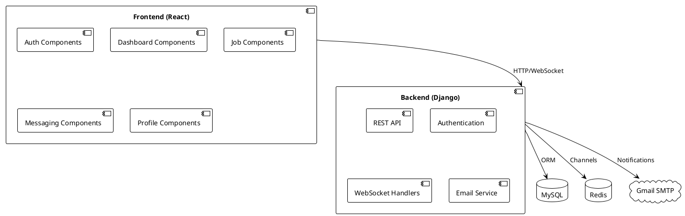
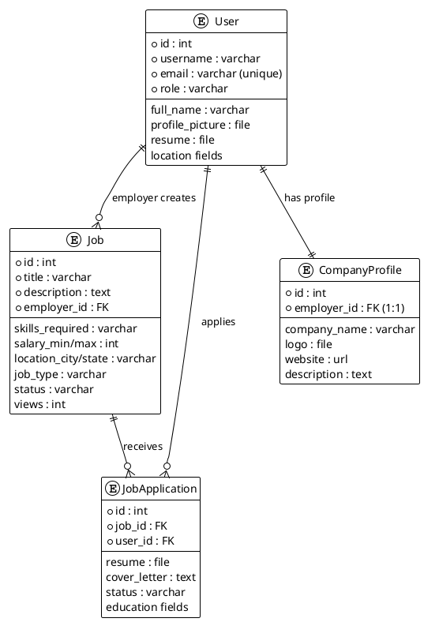
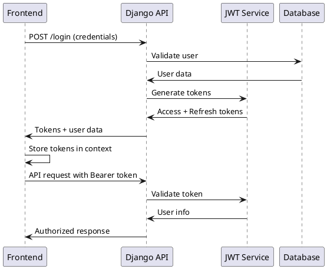

# AI-Powered Job Board Application - Technical Documentation

## Executive Overview

The AI-Powered Job Board is a full-stack web application built with Django REST Framework backend and React frontend, designed to connect job seekers with employers through an intelligent, role-based platform. The system implements comprehensive job posting, application management, messaging, and notification features with JWT-based authentication and real-time capabilities.

**Core Value Proposition**: While labeled as "AI-powered," the current implementation focuses on robust job board fundamentals with scalable architecture ready for AI enhancements. The system provides advanced filtering, search capabilities, and structured data models that can seamlessly integrate semantic search, resume parsing, and recommendation engines.

## Architecture

### High-Level Components

- **Frontend**: React 19.1.1 with React Router, Bootstrap 5, Redux Toolkit
- **Backend**: Django 5.2.5 + Django REST Framework 3.16.0
- **Authentication**: JWT (Simple JWT 5.5.1)
- **Database**: MySQL (configurable)
- **Real-time**: Django Channels 4.3.1 + Redis 6.4.0
- **File Storage**: Local media storage (configurable for cloud)
- **Email**: SMTP (Gmail configuration)



## Data Model & Storage

### Core Models

1. **User** (Custom AbstractUser)
   - Role-based: admin, employer, job_seeker
   - Profile fields: full_name, gender, phone, location
   - File uploads: profile_picture, resume

2. **Job**
   - Employer relationship
   - Job details: title, description, skills, salary range
   - Location and job type
   - Status and views tracking

3. **JobApplication**
   - User-Job relationship
   - Application materials: resume, cover_letter, portfolio
   - Status workflow: applied → under_review → shortlisted/rejected/hired

4. **CompanyProfile**
   - One-to-one with User (employer)
   - Company details and branding

5. **Message & Notification**
   - Real-time communication system
   - Read status tracking



### File Storage

- **Location**: `jobboard/media/`
- **Structure**:
  - `profile_pictures/`: User avatars
  - `resumes/`: Job seeker and application resumes
  - `company_logos/`: Employer branding
  - `job_descriptions/`: Job description PDFs

## Feature-by-Feature Implementation

### 1. Role-Based Authentication & Authorization

#### User Roles & Permissions Matrix

| Action | Admin | Employer | Job Seeker |
|--------|-------|----------|------------|
| Create Job | ✓ | ✓ | ✗ |
| Edit Own Job | ✓ | ✓ | ✗ |
| View Job Applications | ✓ | ✓ (own jobs) | ✓ (own) |
| Apply to Job | ✗ | ✗ | ✓ |
| Message Users | ✓ | ✓ | ✓ |
| View Analytics | ✓ | ✓ (own data) | ✓ (own data) |

#### Implementation

**Frontend Routes** (`frontend/src/App.js`):
- Protected routes with `ProtectedRoute` component
- Role-based access control via `allowedRoles` prop

**Backend Permissions** (`jobboard/users/views.py`):
```python
class IsEmployer(BasePermission):
    def has_permission(self, request, view):
        return request.user.is_authenticated and request.user.role == 'employer'
```

**JWT Token Flow**:
1. User submits credentials → `CustomTokenObtainPairSerializer`
2. Backend validates → generates access/refresh tokens
3. Frontend stores tokens → includes in API requests
4. Backend validates → grants access based on role



### 2. Job Posting & Management

#### User Flow
1. Employer navigates to `/employer/post-job`
2. Fills job form with validation
3. Submits → API creates job record
4. Redirects to job management dashboard

#### Frontend Implementation
- **Component**: `frontend/src/components/jobs/PostJob.js`
- **Form validation**: Bootstrap form controls
- **File upload**: Job description PDF support

#### Backend Implementation
- **Endpoint**: `POST /api/jobs/` (`JobListCreateAPIView`)
- **Serializer**: `JobSerializer` with validation
- **Permissions**: `IsEmployer` required
- **Activity Tracking**: Creates `EmployerActivity` record

**Key Code Reference** (`jobboard/users/views.py:JobListCreateAPIView.perform_create`):
```python
def perform_create(self, serializer):
    job = serializer.save(employer=self.request.user)
    EmployerActivity.objects.create(
        employer=self.request.user,
        activity_type='job_posted',
        details=f"Posted a new job: '{job.title}'"
    )
```

### 3. Job Search & Filtering

#### Search Capabilities
- **Keyword Search**: Title, description, skills
- **Location Filter**: City/state matching
- **Job Type Filter**: Full-time, part-time, remote, internship
- **Company Search**: Company name matching
- **Salary Range**: Min/max filtering

#### Implementation
**Frontend**: `frontend/src/components/jobs/BrowseJobs.js`
**Backend**: `JobSearchAPIView` with Django Q objects

**Search Logic** (`jobboard/users/views.py:JobSearchAPIView`):
```python
if keyword:
    queryset = queryset.filter(
        Q(title__icontains=keyword) |
        Q(description__icontains=keyword) |
        Q(skills_required__icontains=keyword)
    )
```

### 4. Application Management

#### Application Workflow
1. Job seeker views job → clicks "Apply"
2. Fills application form (resume, cover letter, education)
3. Submits → creates `JobApplication` record
4. Employer receives notification
5. Employer reviews → updates status
6. Job seeker receives status notification

#### Status States
- `applied` → `under_review` → `shortlisted`/`rejected`/`hired`

#### Implementation Details
**Endpoints**:
- `POST /api/applications/` - Submit application
- `PATCH /api/applications/{id}/` - Update status (employer only)
- `GET /api/jobs/{id}/applications/` - View job applications

**Validation** (`jobboard/users/views.py:JobApplicationListCreateAPIView`):
- Deadline checking
- Duplicate application prevention
- Role-based permissions

### 5. Real-time Messaging System

#### Architecture
- **Django Channels**: WebSocket support
- **Redis**: Channel layer backend
- **Consumer**: `jobboard/users/consumers.py`

#### Message Flow
1. User composes message → frontend sends to API
2. `MessageCreateAPIView` saves to database
3. Creates notification for recipient
4. WebSocket consumer broadcasts real-time update

#### Implementation
**Frontend**: `frontend/src/components/messaging/MessagingPage.js`
**Backend**: 
- `Message` model with sender/recipient
- `ConversationListAPIView` for message threads
- Real-time via Channels

### 6. Notification System

#### Types
- Application status updates
- New message alerts
- Job posting confirmations
- System notifications

#### Implementation
**Model**: `Notification` with user, message, link, read status
**API Endpoints**:
- `GET /api/notifications/` - List notifications
- `POST /api/notifications/{id}/read/` - Mark as read
- `GET /api/notifications/unread-count/` - Badge count

### 7. Dashboard Analytics

#### Role-Specific Dashboards

**Job Seeker Dashboard**:
- Application count and status breakdown
- Recent applications
- Profile completion status

**Employer Dashboard**:
- Posted jobs count
- Total applications received
- Recent employer activities

**Admin Dashboard** (prepared):
- System-wide user/job/application counts
- Moderation tools placeholder

#### Implementation
**Endpoints**: `EmployerDashboardAPIView`, `JobSeekerDashboardAPIView`
**Frontend**: Role-specific dashboard components

## API Reference

### Authentication Endpoints

| Method | Endpoint | Auth | Description |
|--------|----------|------|-------------|
| POST | `/api/login/` | None | Obtain JWT tokens |
| POST | `/api/register/` | None | User registration |
| POST | `/api/token/refresh/` | Refresh Token | Get new access token |

### Job Management

| Method | Endpoint | Auth | Description |
|--------|----------|------|-------------|
| GET/POST | `/api/jobs/` | Public/Employer | List jobs / Create job |
| GET/PUT/DELETE | `/api/jobs/{id}/` | Authenticated | Job CRUD |
| GET | `/api/employer/jobs/` | Employer | Employer's jobs |
| GET | `/api/job-search/` | Authenticated | Advanced search |

### Application Management

| Method | Endpoint | Auth | Description |
|--------|----------|------|-------------|
| GET/POST | `/api/applications/` | Authenticated | List/Create applications |
| GET/PATCH | `/api/applications/{id}/` | Authenticated | View/Update application |
| GET | `/api/jobs/{id}/applications/` | Employer | Job applications |

### Messaging & Notifications

| Method | Endpoint | Auth | Description |
|--------|----------|------|-------------|
| GET | `/api/conversations/` | Authenticated | Message threads |
| GET | `/api/messages/{user_id}/` | Authenticated | Messages with user |
| POST | `/api/messages/create/` | Authenticated | Send message |
| GET | `/api/notifications/` | Authenticated | User notifications |

## Environment & Configuration

### Key Environment Variables

| Variable | Purpose | Example |
|----------|---------|---------|
| `SECRET_KEY` | Django security | `django-insecure-...` |
| `DEBUG` | Development mode | `True` |
| `DATABASE_*` | MySQL connection | `localhost:3306` |
| `EMAIL_HOST_*` | SMTP configuration | Gmail settings |
| `CLIENT_URL` | Frontend URL | `http://localhost:3000` |
| `REDIS_URL` | Channels backend | `redis://localhost:6379` |

### Configuration Files

**Backend Settings** (`jobboard/jobboard/settings.py`):
- Database configuration (MySQL)
- CORS settings for frontend
- JWT token lifetimes
- Media/static file paths

**Frontend Configuration** (`frontend/package.json`):
- React and dependencies
- Build/development scripts
- Testing configuration

## Dependencies & Rationale

### Backend Dependencies

| Package | Version | Purpose |
|---------|---------|---------|
| Django | 5.2.5 | Web framework |
| djangorestframework | 3.16.0 | API development |
| djangorestframework-simplejwt | 5.5.1 | JWT authentication |
| channels | 4.3.1 | WebSocket support |
| django-cors-headers | 4.7.0 | CORS handling |
| mysqlclient | 2.2.7 | MySQL database driver |
| redis | 6.4.0 | Caching and channels |

### Frontend Dependencies

| Package | Version | Purpose |
|---------|---------|---------|
| React | 19.1.1 | UI framework |
| react-router-dom | 7.7.1 | Client-side routing |
| axios | 1.11.0 | HTTP client |
| react-bootstrap | 2.10.10 | UI components |
| @reduxjs/toolkit | 2.8.2 | State management |

## Performance & Scaling Considerations

### Database Optimizations
- **Indexes**: Email uniqueness, foreign key indexes
- **Query Optimization**: `select_related()` for job applications
- **Pagination**: Ready for implementation in list views

### Caching Strategy
- **Redis**: Channel layers for real-time features
- **File Storage**: Local media with cloud migration path
- **Static Files**: CDN-ready configuration

### Scalability Notes
- **Database**: MySQL with migration path to PostgreSQL
- **File Storage**: Local with S3 integration ready
- **Background Tasks**: Celery integration prepared
- **Load Balancing**: ASGI deployment ready

## Security & Compliance

### Authentication Security
- **JWT Tokens**: Short-lived access (1 hour), longer refresh (1 day)
- **Password Validation**: Django's built-in validators
- **CORS**: Configured for frontend domain
- **CSRF**: Django protection enabled

### File Upload Security
- **File Type Validation**: Image/PDF restrictions
- **Storage Location**: Outside web root
- **Size Limits**: Configurable via Django settings

### Data Protection
- **Email Uniqueness**: Enforced at database level
- **Permission Checks**: Role-based access control
- **Input Validation**: Serializer-level validation

## Known Gaps & TODOs

### Current Limitations
1. **AI Features**: Placeholder for semantic search and resume parsing
2. **Email Templates**: Basic HTML templates need enhancement
3. **File Storage**: Local only, needs cloud integration
4. **Background Jobs**: No async task processing yet
5. **Rate Limiting**: Not implemented
6. **Comprehensive Testing**: Unit tests need expansion

### Technical Debt
1. **Error Handling**: Needs global error boundaries
2. **Logging**: Basic Django logging, needs structured logging
3. **Monitoring**: No application performance monitoring
4. **Security Headers**: Additional security middleware needed

### Missing Features
1. **Job Bookmarking**: Save jobs for later
2. **Advanced Filters**: Salary range, experience level
3. **Company Reviews**: Employer rating system
4. **Video Interviews**: Integration with video platforms
5. **Payment Integration**: Premium job posting features

## Local Development Setup

### Prerequisites
- Python 3.12+
- Node.js 18+
- MySQL 8.0+
- Redis 7.0+

### Backend Setup
```bash
# 1. Clone and navigate
cd C:\Users\admin\OneDrive\Desktop\jobBoard\jobboard

# 2. Create virtual environment
python -m venv venv
venv\Scripts\activate  # Windows

# 3. Install dependencies
pip install -r requirements.txt

# 4. Configure database
# Update settings.py with MySQL credentials

# 5. Run migrations
python manage.py makemigrations
python manage.py migrate

# 6. Create superuser
python manage.py createsuperuser

# 7. Start development server
python manage.py runserver
```

### Frontend Setup
```bash
# 1. Navigate to frontend
cd C:\Users\admin\OneDrive\Desktop\jobBoard\frontend

# 2. Install dependencies
npm install

# 3. Start development server
npm start
```

### Verification Steps
1. **Backend API**: `http://localhost:8000/api/jobs/`
2. **Frontend**: `http://localhost:3000`
3. **Admin Panel**: `http://localhost:8000/admin/`
4. **Redis**: Ensure running on port 6379

### Sample Data Creation
```python
# Django shell: python manage.py shell
from users.models import User, Job, CompanyProfile

# Create test employer
employer = User.objects.create_user(
    username='testemployer',
    email='employer@test.com',
    password='testpass123',
    role='employer',
    full_name='Test Company HR'
)

# Create company profile
company = CompanyProfile.objects.create(
    employer=employer,
    company_name='Test Tech Corp',
    description='Leading technology company',
    location_city='San Francisco',
    location_state='CA',
    contact_email='hr@testtech.com'
)

# Create test job
job = Job.objects.create(
    employer=employer,
    title='Senior Software Engineer',
    description='Build amazing applications',
    skills_required='Python, Django, React',
    salary_min=80000,
    salary_max=120000,
    location_city='San Francisco',
    location_state='CA',
    job_type='Full-Time'
)
```

---

**Document Version**: 1.0  
**Last Updated**: September 3, 2025  
**Author**: Senior Staff Engineer Documentation  
**Repository**: `C:\Users\admin\OneDrive\Desktop\jobBoard\`
